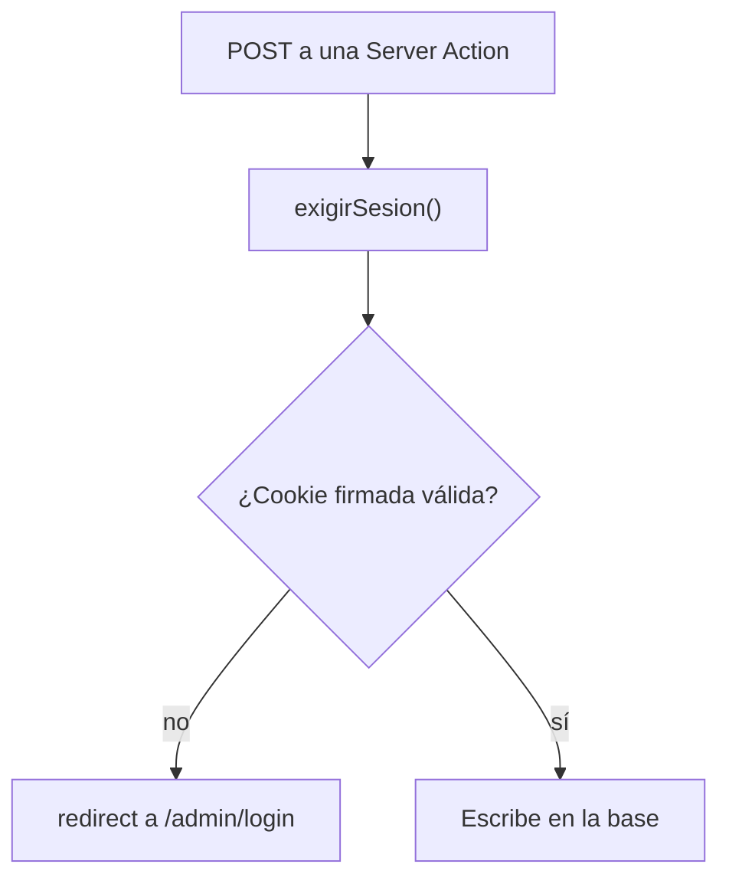

<div align="center">

# Shaula Tulum

**Catálogo de ropa artesanal mexicana.**
Estilo atemporal, hecho 100% a mano por artesanos de México.


</div>

<br>


<br>

## No es una tienda, y eso es una decisión

No hay carrito, ni pasarela de pago, ni checkout. Es un catálogo navegable: se
mira, se filtra, y la compra se coordina por contacto directo.

Esa decisión no está sólo en el texto — está en toda la interfaz. Donde otra
tienda pondría "Agregar al carrito", acá dice *"Consultá por esta pieza"*. Es
una marca que produce en tandas cortas y conversa cada venta; una pasarela de
pago sería mentirle al comprador sobre cómo funciona el negocio.

## El catálogo

24 piezas con búsqueda, filtro por categoría y por precio, y cuatro órdenes. La
búsqueda no mira sólo el nombre: también la tela, la descripción y los colores —
alguien que busca "lino" o "verde cenote" encuentra lo que busca.


## La ficha de cada pieza

Tela, colores y talles, más las otras piezas de la misma familia. Las 24 fichas
se pre-generan en el build, así que abren instantáneo.


## Nosotros


## Cómo se protege el panel

El panel de `/admin` es de una sola persona: la dueña de la marca cargando
piezas. No hay proveedor de identidad ni tabla de usuarios — hay una contraseña
en variable de entorno y una cookie firmada con HMAC-SHA256.

Que este README explique el mecanismo no lo debilita: la seguridad está en el
secreto, no en el algoritmo. Lo que sí importa es dónde se verifica.



**Cada acción que modifica datos llama `exigirSesion()` en su primera línea** —
crear, editar, borrar, publicar y ajustar stock. No alcanza con que el layout
esconda los botones: alguien puede hacer POST a una Server Action directamente.
La autorización vive en la capa de datos, no en la UI.

Detalles que importan: la comparación de contraseñas usa `timingSafeEqual` para
no filtrar información por cuánto tarda; la cookie es `httpOnly`, `sameSite=lax`
y `secure` en producción; y `/admin` lleva `robots: noindex`.

## Tests

24 tests sobre la lógica pura, en ~90 ms, sin navegador ni base de datos:

| Qué | Dónde |
|---|---|
| Filtrado del catálogo: categoría, rangos de precio, búsqueda por tela y color | [`catalogo-filtros.test.ts`](src/lib/catalogo-filtros.test.ts) |
| Los cuatro órdenes, y el desempate por nombre | ídem |
| Identificadores de URL: acentos, apóstrofes, largo máximo | [`slug.test.ts`](src/lib/slug.test.ts) |

```bash
npm test
```

El filtrado vivía adentro de un `useMemo` en `CatalogoCliente`, así que no había
forma de probarlo sin montar el componente. Ahora está en
[`src/lib/catalogo-filtros.ts`](src/lib/catalogo-filtros.ts) como función pura:
entran productos y criterios, salen productos ordenados.

## Correr el proyecto

```bash
npm install
cp .env.example .env.local   # y completá ADMIN_PASSWORD
npm run dev                  # http://localhost:3200
```

## Panel de administración

En `/admin`. Permite cargar piezas, editarlas, ocultarlas sin borrarlas, y
llevar el inventario (`+` / `−` desde la lista, o un número exacto en la ficha).
Cada movimiento de stock queda registrado en `movimientos_stock` con su motivo,
así "¿por qué había 12 y ahora hay 4?" tiene respuesta.

| Variable | Para qué | Si falta |
|---|---|---|
| `ADMIN_PASSWORD` | Entrar al panel | El panel avisa y no deja entrar |
| `DATABASE_URL` | Guardar los productos | **El sitio anda igual** con el catálogo de ejemplo; el panel avisa que no puede guardar |

Esa segunda fila es a propósito: se puede desplegar y ver el sitio en línea hoy, y
conectar la base después, sin un estado roto en el medio.

### Conectar la base

```bash
npm run db:push    # crea las tablas
npm run db:seed    # carga las 24 piezas de ejemplo (no pisa lo que ya exista)
npm run db:studio  # explorador visual de la base
```

## Comandos

| Comando | Qué hace |
|---|---|
| `npm run dev` | Desarrollo, en el puerto 3200 |
| `npm run build` / `npm start` | Build de producción y servirlo |
| `npm test` | Los 24 tests |
| `npm run typecheck` | `tsc --noEmit` |
| `npm run lint` | ESLint |
| `npm run db:push` / `db:seed` / `db:studio` | Base de datos |

## Desplegar

Corre en [Vercel](https://vercel.com/) con la base en Neon. Variables a
configurar en Settings → Environment Variables:

- `ADMIN_PASSWORD` — larga y propia, **no** la de `.env.local`
- `DATABASE_URL` — la inyecta Vercel sola si creás la base desde la pestaña Storage

### Antes de salir a producción

- [ ] Cambiar `ADMIN_PASSWORD` por una propia y larga
- [ ] Reemplazar las fotos de Unsplash por las reales
- [ ] Poner los datos de contacto verdaderos
- [ ] Cargar el catálogo real desde el panel

## Qué hay

| Ruta | Qué es |
|---|---|
| `/` | Landing: filosofía de la casa, más vendidos, tendencia, categorías |
| `/catalogo` | Grilla completa con búsqueda, filtro por categoría y precio, y orden |
| `/catalogo/[id]` | Ficha de cada pieza — 24 páginas pre-generadas en build |
| `/nosotros` | Quiénes somos, cómo se produce, qué no hacemos |
| `/contacto` | Formulario + canales directos + datos del taller |
| `/admin` | Panel: piezas, inventario y movimientos de stock |

## Decisiones de diseño

**Paleta.** Arena de Tulum con acento **madera** (`#7d5a3c`), el tono del
chicozapote con el que se hacen las vigas y los mostradores de la zona. Es tierra
sin caer en el terracota anaranjado: se apoya en la arena en vez de pelearse con
ella.

**Logo.** El de la marca: el trazo de pincel que baja afinándose y el anillo al
costado. Está **recreado como path SVG** (`src/components/Logo.tsx`) para que sea
nítido a cualquier tamaño y herede el color por `currentColor` — cosa que un PNG
no puede hacer. Se usa en el header, el footer y el favicon (`src/app/icon.svg`).

⚠️ Es una recreación, no el archivo original: **la textura de tinta del dibujo a
mano no está**. A tamaño de header no se notaría igual, pero para impresión,
etiquetas o tamaños grandes hay que reemplazarlo por el archivo real.

**Tipografía.** *Fraunces* para títulos (serif con eje óptico variable, carácter
artesanal — va con el concepto de "no ropa industrial") y *Karla* para texto.

**Un solo mundo visual.** No hay modo oscuro a propósito: un catálogo de lino
crudo en negro traiciona el concepto. Por eso todos los colores se pintan
explícitos y la página se ve igual con el sistema en claro o en oscuro.

**Fotos de prueba, elegidas mirándolas.** Las 23 fotos de `public/prendas/` son
de Unsplash (licencia libre, uso comercial permitido) y están asignadas prenda
por prenda **después de mirar cada una**, no por el nombre del archivo. Son datos
de prueba: hay que reemplazarlas por fotos reales del producto. El campo es
`foto` en `src/data/productos.ts`; si una prenda no la tiene, la tarjeta cae sola
a la muestra de tela dibujada en CSS (`MuestraTela`), así que nunca hay un cuadro
roto.

**Pensado para el teléfono primero.** Una tarjeta por fila en móvil (dos dejaba
las prendas del tamaño de una estampilla), dos en tablet, tres o cuatro en
desktop. Los filtros no envuelven nunca: buscador y precio en un renglón, las
categorías en una tira que scrollea de costado con difuminado al borde.

**El formulario no miente.** No hay backend, así que en vez de simular un envío
con un "¡Gracias!" falso, arma el mensaje y abre el cliente de correo del
visitante. Funciona sin servidor y no promete nada que no ocurra.

## Dónde tocar cosas

- **Productos**: `src/data/productos.ts` — un solo archivo, 24 piezas. Los flags
  `masVendido` / `trending` / `nuevo` son los que alimentan los carruseles de la
  landing y el orden "Destacados".
- **Categorías**: mismo archivo, arreglo `CATEGORIAS`.
- **Paleta y tipografía**: bloque `@theme` en `src/app/globals.css`.
- **Datos de contacto**: `src/app/contacto/page.tsx` (constante `CANALES`) y
  `src/components/FormularioContacto.tsx` (constante `DESTINO`). Hoy son de
  ejemplo — hay que reemplazarlos por los reales.

## Pendiente

- **Fotos reales del producto.** Las actuales son de Unsplash, de prueba.
- **Contenido del Instagram** ([@shaula_tulum](https://www.instagram.com/shaula_tulum/)).
  Instagram bloquea la descarga de fotos y textos de posts sin autenticación: se
  puede leer la bio y nada más. Para traer el feed hace falta la API de Instagram
  (cuenta de empresa + token) o bajarlo a mano.
- **Archivo original del logo**, si se necesita el grano de tinta (impresión,
  etiquetas). El vector actual sirve para pantalla.
- **Datos de contacto reales.** El correo, el WhatsApp y la dirección del taller
  hoy son de ejemplo.
- **Catálogo real**: las 24 prendas, sus nombres, telas y precios son inventados
  como estructura. Hay que reemplazarlos por los de la marca.
- Dominio y despliegue.
