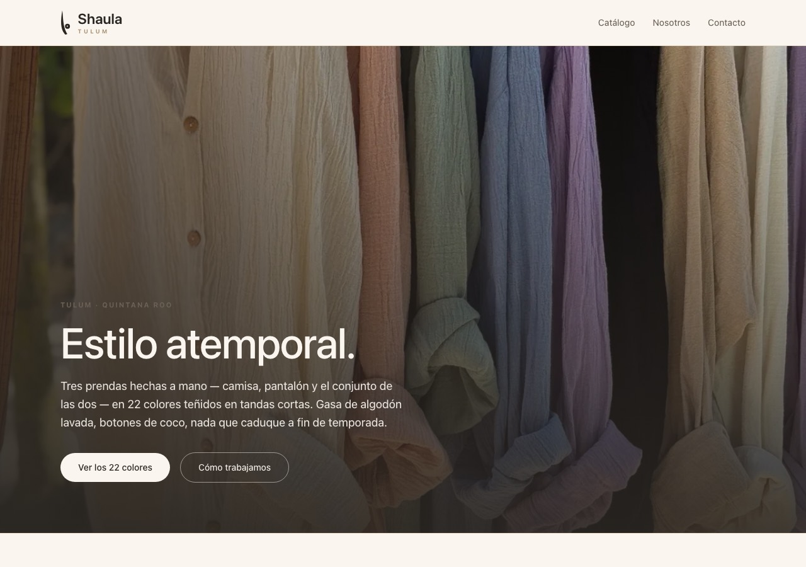
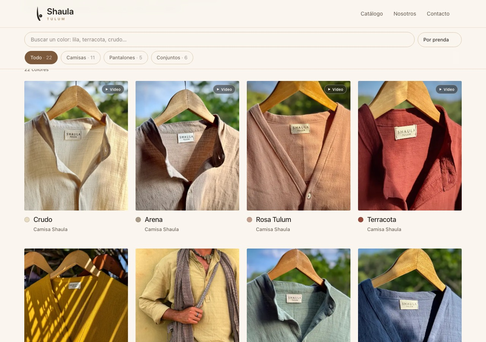
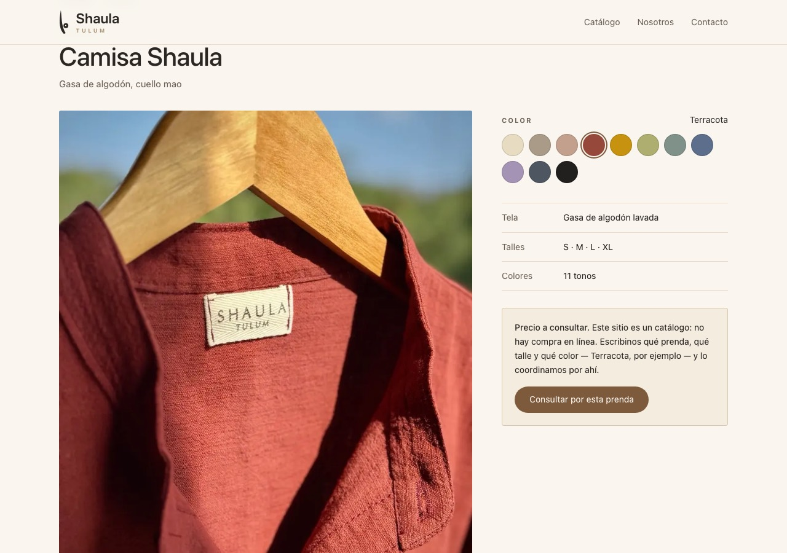
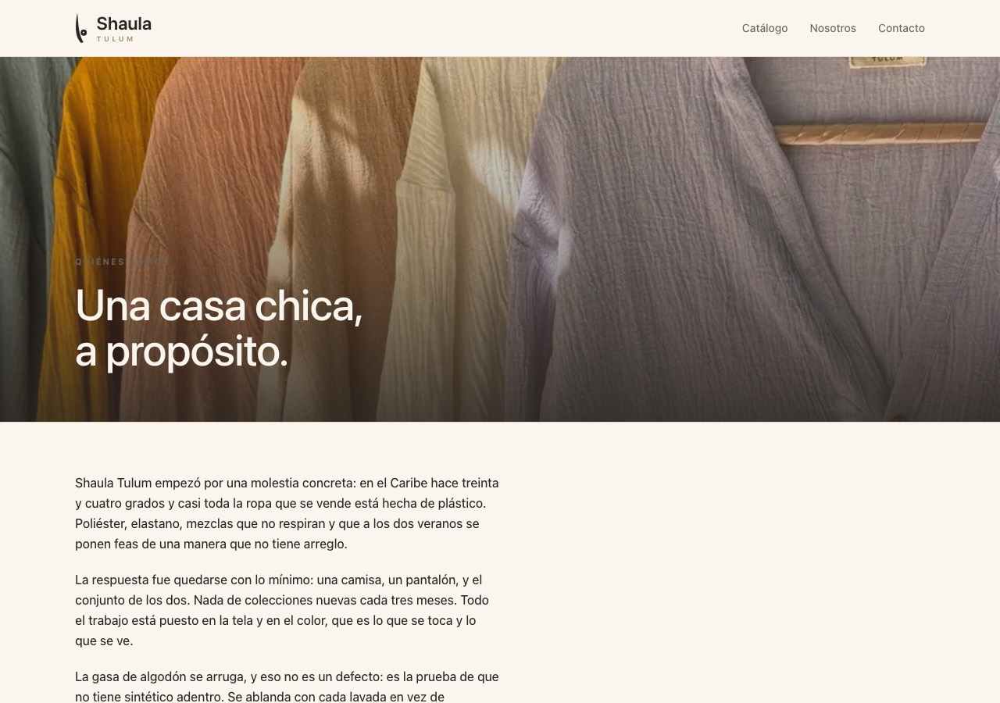
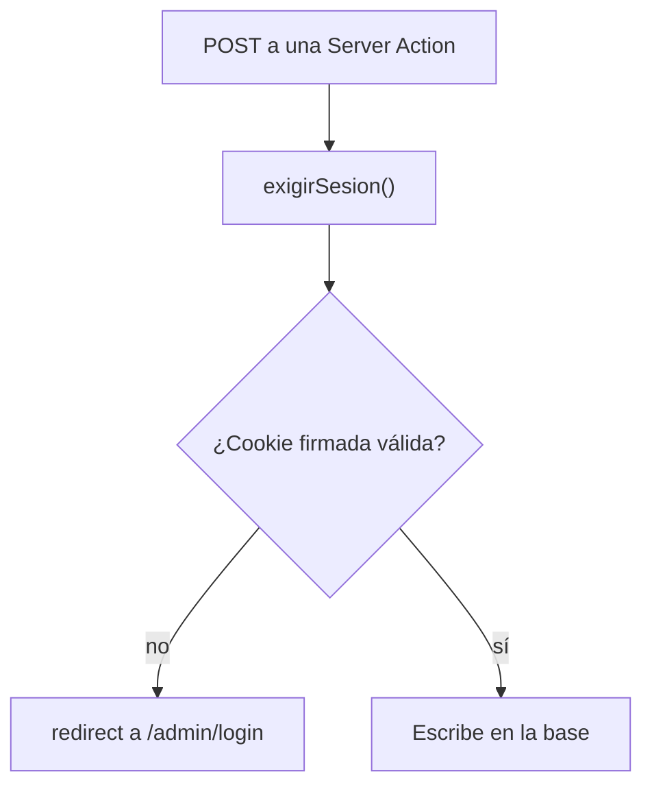

<div align="center">

# Shaula Tulum

**Catálogo de ropa artesanal mexicana.**
Tres prendas, veintidós colores, hechas a mano en Tulum.


</div>

<br>



<br>

## Tres prendas, y el color como producto

La casa hace **una camisa, un pantalón y el conjunto de las dos**. Eso es todo.
Lo que cambia entre una pieza y otra no es el molde — es el color, y el color se
tiñe a mano en tandas cortas.

Por eso el modelo de datos no es una lista de veintidós productos sueltos: son
**tres productos con sus variantes de color**, y cada variante trae su propia
fotografía y su propio video.

```ts
type Variante = {
  slug: string;      // "lila"
  nombre: string;    // "Lila"
  hex: string;       // la muestra del selector, sacada de la foto
  fotos: string[];
  videos?: { src: string; poster: string }[];
};
```

Esa decisión se nota en toda la interfaz. El selector de color **no lista
nombres: pinta la tela**, y al cambiar de tono cambia la galería entera —
porque cada color está fotografiado por separado, no es la misma foto teñida
en CSS.

| Prenda | Colores |
|---|---|
| Camisa | Crudo · Arena · Rosa Tulum · Terracota · Mostaza · Verde Pistacho · Verde Salvia · Azul Índigo · Lila · Gris Grafito · Negro |
| Pantalón | Crudo · Camel · Terracota · Verde Olivo · Negro |
| Conjunto | Verde Pistacho · Crudo · Arena · Terracota · Verde Olivo · Negro |

## No es una tienda, y eso es una decisión

No hay carrito, ni pasarela de pago, ni checkout. Es un catálogo navegable: se
mira, se filtra por color, y la compra se coordina por contacto directo.

Donde otra tienda pondría "Agregar al carrito", acá dice *"Consultar por esta
prenda"* — y el enlace se lleva la prenda y el color a la página de contacto,
así el formulario llega con todo puesto.

**Tampoco hay precios inventados.** Mientras no haya lista, la ficha dice
*"Precio a consultar"*. El campo existe en la base y en el panel: el día que se
cargue, aparece solo.

## El catálogo



El catálogo lista **colores, no prendas**: la camisa lila y la camisa negra son
dos tarjetas, porque son dos cosas distintas para quien mira. Veintidós fichas,
con filtro por prenda y una búsqueda que entiende colores, telas y nombres.

Un detalle que salió de un test: la búsqueda **no** mira los otros colores de la
misma prenda. Si los mirara, buscar "lila" traería las once camisas —todas
comparten la lista de colores— en vez de la camisa lila, que es justo la
tarjeta que la persona busca.

## La ficha de cada prenda



Galería con fotos y videos del color elegido, selector de tonos, cómo está
hecha, cómo se lava, y las fotos de contexto. La dirección se mantiene al día
(`?color=lila`) con `replaceState`, así se puede compartir el enlace de un color
sin recargar nada.

## El video no es decoración

Una foto no muestra cómo cae una gasa de algodón. Los seis videos del catálogo
son la misma ropa colgada al sol, moviéndose. Van con `preload="none"` y póster,
así no pesan hasta que alguien los pide.

## Nosotros



## De dónde salen las fotos

Las fotos y los videos de `public/media` son **material real de la marca**,
convertido para web con herramientas del sistema — sin dependencias nuevas:

| Origen | Destino | Con qué |
|---|---|---|
| `.HEIC` / `.JPG` (hasta 5712 px) | JPEG 1600 px, calidad 60 | `sips` |
| `.MOV` HEVC 4K vertical | MP4 H.264 960×540 | `avconvert` |
| primer cuadro del `.MOV` | póster JPEG | `qlmanage` + `sips` |

Los duplicados del volcado original (`IMG_9005 2.HEIC`, `IMG_9005 3.HEIC`…) se
descartaron por hash: de 102 archivos quedaron 47 con contenido único — 41 fotos
y 6 videos.

**Cada archivo se miró antes de nombrarlo**, y después se volvió a mirar ya
renombrado para verificar que el nombre correspondiera a la foto. En esa segunda
pasada aparecieron dos archivos cruzados — sin ese control, el perchero de todos
los colores habría quedado como "look" y un retrato como foto de portada.

Los nombres son descriptivos (`camisa-lila-1.jpg`, `pantalon-negro-1.jpg`,
`video-camisa-terracota.mp4`) y un test verifica que toda ruta declarada exista.

## Cómo se protege el panel

El panel de `/admin` es de una sola persona: la marca cargando prendas. No hay
proveedor de identidad ni tabla de usuarios — hay una contraseña en variable de
entorno y una cookie firmada con HMAC-SHA256.

Que este README explique el mecanismo no lo debilita: la seguridad está en el
secreto, no en el algoritmo. Lo que sí importa es dónde se verifica.



**Cada acción que modifica datos llama `exigirSesion()` en su primera línea** —
crear, editar, borrar, publicar y ajustar stock. No alcanza con que el layout
esconda los botones: alguien puede hacer POST a una Server Action directamente.
La autorización vive en la capa de datos, no en la UI.

Detalles que importan: la comparación de contraseñas usa `timingSafeEqual` para
no filtrar información por cuánto tarda; la cookie es `httpOnly`, `sameSite=lax`
y `secure` en producción; y `/admin` lleva `robots: noindex`.

El panel edita textos, talles, precio, stock y qué se publica. **Los colores y su
fotografía se cargan con el código**, en `src/data/productos.ts`, junto a los
archivos de `public/media`: son media versionada, no un campo de formulario.

## Tests

27 tests sobre la lógica pura, en ~90 ms, sin navegador ni base de datos:

| Qué | Dónde |
|---|---|
| Expandir prendas en fichas de color, filtrar por prenda y buscar por color o tela | [`catalogo-filtros.test.ts`](src/lib/catalogo-filtros.test.ts) |
| Los dos órdenes (por prenda y por color) y sus desempates | ídem |
| Invariantes del catálogo real: toda variante con foto, hex de seis dígitos, sin colores repetidos, rutas bajo `/media` | ídem |
| Identificadores de URL: acentos, apóstrofes, largo máximo | [`slug.test.ts`](src/lib/slug.test.ts) |

```bash
npm test
```

## Correr el proyecto

```bash
npm install
cp .env.example .env.local   # y completá ADMIN_PASSWORD
npm run dev                  # http://localhost:3200
```

## Panel de administración

En `/admin`. Permite editar las prendas, ocultarlas sin borrarlas, y llevar el
inventario (`+` / `−` desde la lista, o un número exacto en la ficha). Cada
movimiento de stock queda registrado en `movimientos_stock` con su motivo, así
"¿por qué había 12 y ahora hay 4?" tiene respuesta.

| Variable | Para qué | Si falta |
|---|---|---|
| `ADMIN_PASSWORD` | Entrar al panel | El panel avisa y no deja entrar |
| `DATABASE_URL` | Guardar los cambios | **El sitio anda igual** con el catálogo del código; el panel avisa que no puede guardar |

Esa segunda fila es a propósito: se puede desplegar y ver el sitio en línea hoy, y
conectar la base después, sin un estado roto en el medio.

### Conectar la base

```bash
npm run db:push    # crea las tablas
npm run db:seed    # carga las tres prendas con sus colores (no pisa lo que ya exista)
npm run db:studio  # explorador visual de la base
```

## Comandos

| Comando | Qué hace |
|---|---|
| `npm run dev` | Desarrollo, en el puerto 3200 |
| `npm run build` / `npm start` | Build de producción y servirlo |
| `npm test` | Los 27 tests |
| `npm run typecheck` | `tsc --noEmit` |
| `npm run lint` | ESLint |
| `npm run db:push` / `db:seed` / `db:studio` | Base de datos |

## Desplegar

Corre en [Vercel](https://vercel.com/), con la base en Neon si se conecta.
Variables a configurar en Settings → Environment Variables:

- `ADMIN_PASSWORD` — larga y propia, **no** la de `.env.local`
- `DATABASE_URL` — la inyecta Vercel sola si creás la base desde la pestaña Storage

## Qué hay

| Ruta | Qué es |
|---|---|
| `/` | Landing: el perchero de colores, las tres prendas, la carta de tonos, los videos |
| `/catalogo` | Las 22 fichas de color, con filtro por prenda y búsqueda |
| `/catalogo/[id]` | Ficha de la prenda, con selector de color y galería por tono |
| `/nosotros` | Cómo se hace y qué no se hace |
| `/contacto` | Formulario + canales directos |
| `/admin` | Panel: prendas, inventario y movimientos de stock |

## Decisiones de diseño

**Paleta.** Arena de Tulum con acento **madera** (`#7d5a3c`), el tono del
chicozapote con el que se hacen las vigas y los mostradores de la zona. Es tierra
sin caer en el terracota anaranjado: se apoya en la arena en vez de pelearse con
ella.

**Los hex de los colores salen de las fotos**, no de una paleta inventada: el
punto que se toca en el selector y la tela que se ve en la foto son el mismo
color.

**Logo.** El de la marca, **recreado como path SVG** (`src/components/Logo.tsx`)
para que sea nítido a cualquier tamaño y herede el color por `currentColor` —
cosa que un PNG no puede hacer. Se usa en el header, el footer y el favicon.

⚠️ Es una recreación, no el archivo original: **la textura de tinta del dibujo a
mano no está**. A tamaño de header no se nota, pero para impresión o etiquetas
hay que reemplazarlo por el archivo real.

**Tipografía.** *Fraunces* para títulos (serif con eje óptico variable, carácter
artesanal) y *Karla* para texto.

**Un solo mundo visual.** No hay modo oscuro a propósito: un catálogo de gasa
cruda en negro traiciona el concepto. Por eso todos los colores se pintan
explícitos y la página se ve igual con el sistema en claro o en oscuro.

**Pensado para el teléfono primero.** Una tarjeta por fila en móvil (dos dejaba
las prendas del tamaño de una estampilla), dos en tablet, tres o cuatro en
desktop. Los filtros no envuelven nunca: buscador y orden en un renglón, las
prendas en una tira que scrollea de costado con difuminado al borde.

**El formulario no miente.** No hay backend, así que en vez de simular un envío
con un "¡Gracias!" falso, arma el mensaje y abre el cliente de correo del
visitante. Funciona sin servidor y no promete nada que no ocurra.

## Pendiente

Lo que falta es **información del negocio**, no código:

- **Precios.** Hoy la ficha dice "a consultar". Se cargan desde el panel (o en
  `src/data/productos.ts`, campo `precio`) y aparecen solos.
- **Talles.** Están listados S · M · L · XL como supuesto razonable: hay que
  confirmar los reales, prenda por prenda.
- **Datos de contacto.** El correo, el WhatsApp y la dirección del taller son de
  ejemplo. El Instagram sí es el real
  ([@shaula_tulum](https://www.instagram.com/shaula_tulum/)).
- **Textos de la casa** (`/nosotros`, la sección "La idea" de la landing): están
  escritos a partir de lo que muestran las fotos —gasa de algodón, botones de
  coco, teñido en tandas— y hay que confirmarlos con la marca.
- **Archivo original del logo**, si se necesita el grano de tinta.
- Dominio propio.
